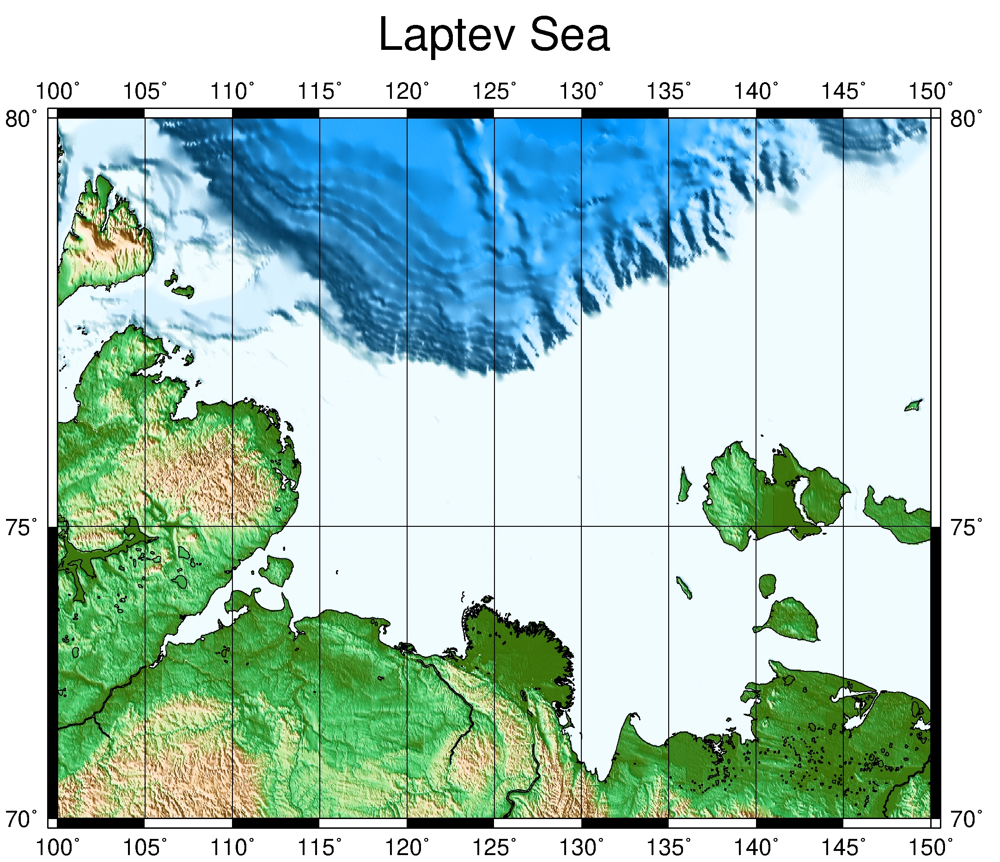

# Laptev Sea 

**Let me give you the basic understanding of my work. The area of my scientific interests is seismicity of Laptev sea region.**

_What do I mean when I say Laptev sea region?_

I mean the following rectangle.

**So, my work is divided into 3 main parts.**

_First_, I need to collect available data of earthquakes which occurred in my region.

_Second_, I should process local wave-form data which I received due to SIOLA project(data from temporary seismic stations in delta area of the Lena river during 2016-2017 years campaign).

_Third_, I am going to plot maps, graphics and make some scientific conclusions.
